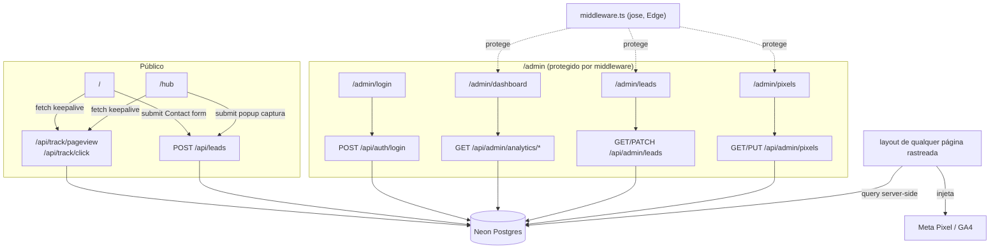
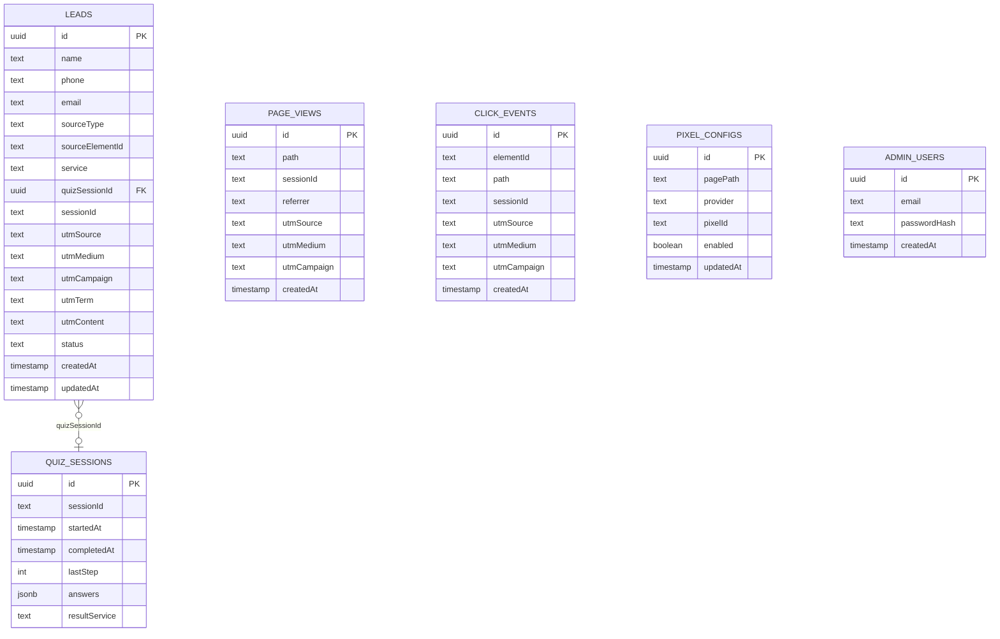

# Design — Painel Admin, Analytics e CRM de Leads

## Stack e decisões técnicas

| Área | Escolha | Motivo |
|---|---|---|
| Banco | Neon Postgres (Vercel Postgres) | serverless, driver HTTP funciona em edge/serverless functions |
| ORM | Drizzle ORM + `@neondatabase/serverless` | leve, type-safe, sem cold start pesado |
| Sessão admin | JWT assinado com `jose` em cookie httpOnly | `jose` roda em Edge Runtime — necessário porque `middleware.ts` do Next roda em Edge |
| Hash de senha | `bcryptjs` | usado só na Route Handler de login (Node runtime), não no middleware |
| Rate limiting | contagem em tabela Postgres (IP + janela de 1 min) | evita dependência nova (Redis/Upstash) no volume de tráfego esperado |
| CSRF | `sameSite: "lax"` + `secure` no cookie de sessão | suficiente pois endpoints públicos não carregam cookie de auth |

## Arquitetura



## Modelo de dados



## Schema Drizzle (`src/db/schema.ts`)

```typescript
import { pgTable, uuid, text, timestamp, integer, boolean, jsonb, pgEnum } from "drizzle-orm/pg-core";

export const leadStatusEnum = pgEnum("lead_status", ["novo", "contatado", "fechado", "perdido"]);
export const leadSourceEnum = pgEnum("lead_source", ["banner", "quiz-cta", "homepage-contact"]);
export const pixelProviderEnum = pgEnum("pixel_provider", ["meta", "ga4"]);

export const adminUsers = pgTable("admin_users", {
  id: uuid("id").primaryKey().defaultRandom(),
  email: text("email").notNull().unique(),
  passwordHash: text("password_hash").notNull(),
  createdAt: timestamp("created_at").defaultNow().notNull(),
});

export const quizSessions = pgTable("quiz_sessions", {
  id: uuid("id").primaryKey().defaultRandom(),
  sessionId: text("session_id").notNull(),
  startedAt: timestamp("started_at").defaultNow().notNull(),
  completedAt: timestamp("completed_at"),
  lastStep: integer("last_step").notNull().default(0),
  answers: jsonb("answers").$type<number[]>().notNull().default([]),
  resultService: text("result_service"),
});

export const leads = pgTable("leads", {
  id: uuid("id").primaryKey().defaultRandom(),
  name: text("name").notNull(),
  phone: text("phone").notNull(),
  email: text("email"),
  sourceType: leadSourceEnum("source_type").notNull(),
  sourceElementId: text("source_element_id"),
  service: text("service"),
  quizSessionId: uuid("quiz_session_id").references(() => quizSessions.id),
  sessionId: text("session_id").notNull(),
  utmSource: text("utm_source"),
  utmMedium: text("utm_medium"),
  utmCampaign: text("utm_campaign"),
  utmTerm: text("utm_term"),
  utmContent: text("utm_content"),
  status: leadStatusEnum("status").notNull().default("novo"),
  createdAt: timestamp("created_at").defaultNow().notNull(),
  updatedAt: timestamp("updated_at").defaultNow().notNull(),
});

export const pageViews = pgTable("page_views", {
  id: uuid("id").primaryKey().defaultRandom(),
  path: text("path").notNull(),
  sessionId: text("session_id").notNull(),
  referrer: text("referrer"),
  utmSource: text("utm_source"),
  utmMedium: text("utm_medium"),
  utmCampaign: text("utm_campaign"),
  utmTerm: text("utm_term"),
  utmContent: text("utm_content"),
  createdAt: timestamp("created_at").defaultNow().notNull(),
});

export const clickEvents = pgTable("click_events", {
  id: uuid("id").primaryKey().defaultRandom(),
  elementId: text("element_id").notNull(),
  path: text("path").notNull(),
  sessionId: text("session_id").notNull(),
  utmSource: text("utm_source"),
  utmMedium: text("utm_medium"),
  utmCampaign: text("utm_campaign"),
  createdAt: timestamp("created_at").defaultNow().notNull(),
});

export const pixelConfigs = pgTable("pixel_configs", {
  id: uuid("id").primaryKey().defaultRandom(),
  pagePath: text("page_path").notNull(),
  provider: pixelProviderEnum("provider").notNull(),
  pixelId: text("pixel_id").notNull(),
  enabled: boolean("enabled").notNull().default(true),
  updatedAt: timestamp("updated_at").defaultNow().notNull(),
});
```

## Interfaces TypeScript de domínio (`src/types/tracking.ts`)

```typescript
export interface UtmParams {
  utmSource?: string;
  utmMedium?: string;
  utmCampaign?: string;
  utmTerm?: string;
  utmContent?: string;
}

export interface TrackPageViewInput extends UtmParams {
  path: string;
  sessionId: string;
  referrer?: string;
}

export interface TrackClickInput extends UtmParams {
  elementId: string;
  path: string;
  sessionId: string;
}

export type LeadSource = "banner" | "quiz-cta" | "homepage-contact";
export type LeadStatus = "novo" | "contatado" | "fechado" | "perdido";

export interface CreateLeadInput extends UtmParams {
  name: string;
  phone: string;
  email?: string;
  sourceType: LeadSource;
  sourceElementId?: string;
  service?: string;
  quizSessionId?: string;
  sessionId: string;
}

export interface AnalyticsSummary {
  period: { from: string; to: string };
  pageViews: { path: string; count: number }[];
  clicks: { elementId: string; count: number }[];
  leadsCount: number;
  quizCompletionRate: number;
}

export interface QuizFunnelStep {
  step: number;
  reached: number;
  completed: number;
}
```

## Componentes de UI (novos)

- `src/components/tracking/LeadCaptureModal.tsx` — modal client-side reutilizável (nome, telefone, e-mail), com estado `idle | submitting | success`; ao suceder, transiciona (fade) para botão de WhatsApp. Usado pelos banners do `/hub` (exceto BrokerApps) e pelo CTA final do quiz.
- `src/hooks/useTrackingSession.ts` — gera/lê `sessionId` (localStorage) e UTM (sessionStorage), expõe `trackPageView()` e `trackClick(elementId)` (fetch `keepalive: true`, sem bloquear).
- `src/components/tracking/PixelScripts.tsx` — server component que lê `pixel_configs` para o path atual e renderiza `<Script>` do Meta Pixel/GA4 quando configurado; renderiza nada se não houver.
- `/admin/login/page.tsx`, `/admin/dashboard/page.tsx`, `/admin/leads/page.tsx`, `/admin/pixels/page.tsx` — telas do painel (server components buscando dados + client components para interatividade de filtro/status).

## Reaproveitamento do Contact.tsx

O `handleSubmit` do `Contact.tsx` troca o `await new Promise(...)` simulado por
`fetch("/api/leads", { method: "POST", body: JSON.stringify({ ...form, sourceType: "homepage-contact", sessionId, ...utm }) })`,
usando o mesmo `useTrackingSession()` para obter `sessionId`/UTM. Nenhum campo do
form atual muda — o backend aceita campos extras (`company`, `segment`,
`investment`, `message`) num `metadata jsonb` opcional na tabela `leads` para não
perder informação que o form já coleta e a v1 do CRM ainda não modela como
colunas próprias.

> Ajuste de schema: adicionar `metadata: jsonb("metadata")` (nullable) em `leads`
> para acomodar esses campos extras do Contact form sem forçar todos os leads
> (que vêm do popup do hub, mais enxuto) a ter as mesmas colunas.

## Middleware de autenticação (`middleware.ts`)

```typescript
export const config = { matcher: ["/admin/:path*"] };
// Exceção interna: /admin/login é liberado dentro do próprio middleware,
// verificando pathname antes de checar o cookie.
```

Verifica cookie `admin_session` com `jose.jwtVerify`; se ausente/inválido/expirado,
redireciona para `/admin/login`. Renovado a cada request válido (rolling 7 dias).

## Perguntas em aberto para a Fase 3

Nenhuma pendência bloqueante.
