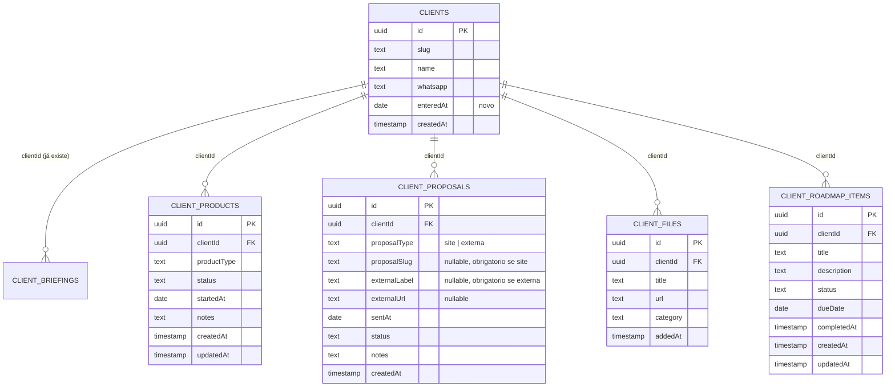

# Design — Workspace de Cliente

## Stack e decisões técnicas

Sem stack nova — reaproveita 100% o que já existe: Neon Postgres + Drizzle ORM,
sessão de admin via `proxy.ts` (matcher já cobre `/admin/:path*` e
`/api/admin/:path*`), páginas do admin como client components buscando dados via
`fetch` em rotas `/api/admin/*`, mesmo padrão de `src/app/api/admin/leads/*` e
`.../pixels/*` já implementados.

| Decisão | Escolha | Motivo |
|---|---|---|
| Arquivos do cliente | **link/referência**, não upload binário | implementar upload real exige um provedor de storage (Vercel Blob ou S3), custo recorrente e superfície de segurança (validação de tipo/tamanho de arquivo) — para v1, o dono da agência já guarda os arquivos em algum lugar (Drive, WhatsApp); o sistema só precisa apontar pra lá. Se o volume/uso comprovar necessidade de upload real depois, é uma extensão aditiva (nova coluna ou tabela), não um retrabalho. |
| Slug de proposta | **texto validado contra uma lista em código**, não FK | páginas de proposta são rotas Next.js estáticas (`src/app/proposta/[slug]/page.tsx`), não registros de banco — não faz sentido uma FK para algo que não é uma tabela. Uma lista centralizada em `src/data/proposals.ts` vira a fonte da verdade tanto para o `<select>` do admin quanto para o link exibido. |
| Proposta sem página no site | campo `proposalType` ("site" \| "externa") em `client_proposals`, com `proposalSlug`/`externalLabel`/`externalUrl` nullable | confirmado que nem toda proposta é uma página do site (PDF, Google Doc, WhatsApp) — em vez de duas tabelas, uma coluna discriminadora com validação em app-level (não em constraint do banco, pra manter simples) cobre os dois casos numa tabela só |
| Upsell | **calculado**, não uma linha "não comprado" | o catálogo de produtos é fixo (enum); "oportunidade de upsell" é só "produto do catálogo menos o que o cliente já tem ativo" — calculado na hora de exibir, sem gravar ausência. |
| Data de entrada do cliente | nova coluna `entered_at` em `clients` | é semanticamente diferente de `created_at` (quando a linha foi criada no banco) — o admin pode estar cadastrando hoje um cliente que entrou há 2 meses. Única mudança aditiva numa tabela que já existe. |

## Modelo de dados



`client_briefings` não muda em nada. `clients` ganha uma única coluna aditiva
(`entered_at`) — não quebra nenhuma leitura existente (`/api/briefings/[client]`,
`/api/admin/clients`).

## Schema Drizzle

### Alteração em `clients` (aditiva)

```typescript
export const clients = pgTable("clients", {
  id: uuid("id").primaryKey().defaultRandom(),
  slug: text("slug").notNull().unique(),
  name: text("name").notNull(),
  whatsapp: text("whatsapp"),
  enteredAt: date("entered_at"), // NOVO — nullable pra não quebrar linhas já existentes
  createdAt: timestamp("created_at").defaultNow().notNull(),
});
```

### Tabelas novas

```typescript
export const clientProductTypeEnum = pgEnum("client_product_type", [
  "trafego_pago",
  "diagnostico_comercial",
  "consultoria",
  "brokerapps",
  "outro",
]);

export const clientProductStatusEnum = pgEnum("client_product_status", [
  "ativo",
  "pausado",
  "encerrado",
]);

export const clientProposalStatusEnum = pgEnum("client_proposal_status", [
  "enviada",
  "aceita",
  "recusada",
]);

export const clientProposalTypeEnum = pgEnum("client_proposal_type", [
  "site",
  "externa",
]);

export const clientFileCategoryEnum = pgEnum("client_file_category", [
  "contrato",
  "material",
  "entregavel",
  "acesso",
  "outro",
]);

export const clientRoadmapStatusEnum = pgEnum("client_roadmap_status", [
  "a_fazer",
  "em_andamento",
  "feito",
]);

export const clientProducts = pgTable("client_products", {
  id: uuid("id").primaryKey().defaultRandom(),
  clientId: uuid("client_id").notNull().references(() => clients.id),
  productType: clientProductTypeEnum("product_type").notNull(),
  status: clientProductStatusEnum("status").notNull().default("ativo"),
  startedAt: date("started_at").notNull().defaultNow(),
  notes: text("notes"),
  createdAt: timestamp("created_at").defaultNow().notNull(),
  updatedAt: timestamp("updated_at").defaultNow().notNull(),
});

export const clientProposals = pgTable("client_proposals", {
  id: uuid("id").primaryKey().defaultRandom(),
  clientId: uuid("client_id").notNull().references(() => clients.id),
  proposalType: clientProposalTypeEnum("proposal_type").notNull().default("site"),
  // "site": obrigatório, validado em app-level contra src/data/proposals.ts
  proposalSlug: text("proposal_slug"),
  // "externa": título livre obrigatório (ex: "Proposta PDF enviada por e-mail")
  externalLabel: text("external_label"),
  externalUrl: text("external_url"),
  sentAt: date("sent_at").notNull().defaultNow(),
  status: clientProposalStatusEnum("status").notNull().default("enviada"),
  notes: text("notes"),
  createdAt: timestamp("created_at").defaultNow().notNull(),
});

export const clientFiles = pgTable("client_files", {
  id: uuid("id").primaryKey().defaultRandom(),
  clientId: uuid("client_id").notNull().references(() => clients.id),
  title: text("title").notNull(),
  url: text("url").notNull(),
  category: clientFileCategoryEnum("category").notNull().default("outro"),
  addedAt: timestamp("added_at").defaultNow().notNull(),
});

export const clientRoadmapItems = pgTable("client_roadmap_items", {
  id: uuid("id").primaryKey().defaultRandom(),
  clientId: uuid("client_id").notNull().references(() => clients.id),
  title: text("title").notNull(),
  description: text("description"),
  status: clientRoadmapStatusEnum("status").notNull().default("a_fazer"),
  dueDate: date("due_date"),
  completedAt: timestamp("completed_at"),
  createdAt: timestamp("created_at").defaultNow().notNull(),
  updatedAt: timestamp("updated_at").defaultNow().notNull(),
});
```

`date` precisa ser importado de `drizzle-orm/pg-core` (hoje o schema não usa esse
tipo).

### Catálogo de propostas (`src/data/proposals.ts`, novo arquivo — não é tabela)

```typescript
export const KNOWN_PROPOSALS = [
  { slug: "vaz-ferreira", label: "Vaz Ferreira Advogados" },
  { slug: "mv-imoveis", label: "MV Imóveis" },
  { slug: "capbox", label: "CapBox" },
  { slug: "francine-leite", label: "Francine Leite (corretora)" },
] as const;
```

Usado pelo `<select>` de "registrar proposta enviada" e para montar o link
`/proposta/{slug}` exibido na pasta do cliente. Ao publicar uma proposta nova,
basta adicionar uma linha aqui — sem migration.

## APIs novas

- **`POST /api/admin/clients`** — cria cliente manualmente (nome, whatsapp,
  enteredAt; slug gerado a partir do nome, com opção de ajustar antes de
  salvar). *(Bloco 1 — sem dependência de nenhuma tabela nova.)*
- **`PATCH /api/admin/clients/[slug]`** — edita dados básicos do cliente
  (nome, whatsapp, enteredAt).
- `GET/POST /api/admin/clients/[slug]/products` — lista / adiciona produto.
- `PATCH /api/admin/clients/[slug]/products/[id]` — altera status.
- `GET/POST /api/admin/clients/[slug]/proposals` — lista / registra proposta
  enviada. Validação por `proposalType`: se `"site"`, `proposalSlug`
  obrigatório e checado contra `KNOWN_PROPOSALS` (rejeita slug desconhecido);
  se `"externa"`, `externalLabel` obrigatório (`externalUrl` opcional).
- `PATCH /api/admin/clients/[slug]/proposals/[id]` — altera status
  (enviada/aceita/recusada).
- `GET/POST /api/admin/clients/[slug]/files` — lista / adiciona referência de
  arquivo.
- `DELETE /api/admin/clients/[slug]/files/[id]` — remove referência.
- `GET/POST /api/admin/clients/[slug]/roadmap` — lista / cria item de roadmap.
- `PATCH /api/admin/clients/[slug]/roadmap/[id]` — atualiza status/data/título
  (preenche `completedAt` ao marcar "feito").

Todas protegidas pelo `proxy.ts` já existente (matcher já cobre
`/api/admin/:path*`), mesmo padrão de autenticação das rotas atuais.

## Componentes de UI (novos/alterados)

- `src/app/admin/(protected)/clients/page.tsx` (altera) — adiciona botão
  **"Novo cliente"** abrindo `ClientForm` (modal ou seção inline); lista
  passa a refletir clientes criados manualmente com a mesma cara dos vindos de
  briefing.
- `src/components/admin/ClientForm.tsx` (novo) — formulário de
  criação/edição de cliente (nome, whatsapp, data de entrada, slug editável na
  criação). *(Bloco 1.)*
- `src/app/admin/(protected)/clients/[slug]/page.tsx` (reestrutura) — seções:
  **Dados básicos** (editável via `ClientForm`), **Produtos** (contratados +
  oportunidades de upsell lado a lado), **Propostas enviadas** (lista com link
  pra `/proposta/[slug]`), **Briefings** (o que já existe hoje, agora uma
  seção entre outras), **Arquivos**, **Roadmap**.
- `src/components/admin/ClientProductsPanel.tsx` (novo) — dois grupos:
  contratados (com toggle de status) e catálogo restante (upsell).
- `src/components/admin/ClientProposalForm.tsx` / lista (novo).
- `src/components/admin/ClientFilesPanel.tsx` (novo) — lista + form de
  adicionar referência de arquivo.
- `src/components/admin/ClientRoadmapPanel.tsx` (novo) — colunas ou lista
  agrupada por status, com data prevista.

## Perguntas em aberto para a Fase 3

Todas resolvidas — ver "Perguntas em aberto — status" em `requirements.md`.
Nenhuma pendência bloqueante para iniciar a implementação.
