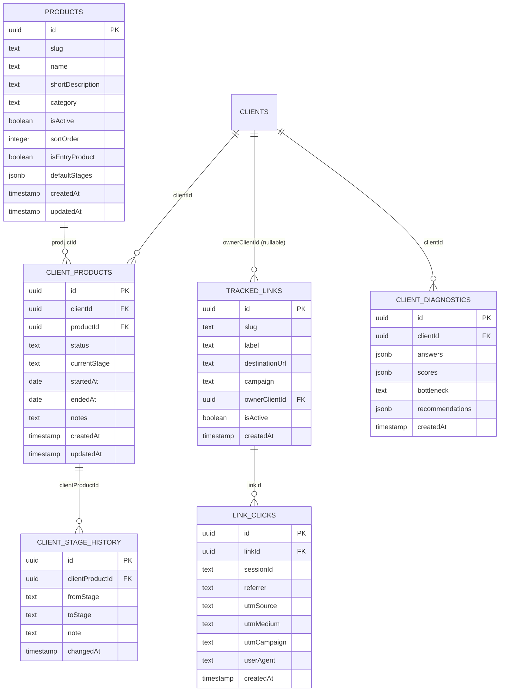

# Design — Plataforma de Operação da Brain

## Decisões técnicas

| Decisão | Escolha | Motivo |
|---|---|---|
| Catálogo de produto | tabela `products`, não `pgEnum` | produto muda com frequência de negócio (preço, nome, ativo/inativo) — enum exige migration pra cada ajuste |
| Estágio do Método | `text` validado contra constante TS (`src/lib/method-stages.ts`, espelha `src/data/method.ts`), não `pgEnum` nem tabela | é metodologia estável da marca (não editável pelo admin no dia a dia como produto é), mas ainda assim evitar o mesmo acoplamento rígido de enum de banco — validação em app-level já é suficiente |
| Status do engajamento | `pgEnum` (`ativo`/`pausado`/`encerrado`) | conjunto genuinamente fechado e estável, ao contrário de produto/estágio |
| Links rastreáveis | tabela própria (`tracked_links` + `link_clicks`) + rota pública `/l/[slug]` | mesmo padrão de `/api/track/*` já existente (fire-and-forget, nunca bloqueia o redirect) |
| Diagnóstico | reaproveita `client_briefings.payload` como matéria-prima; não duplica o schema do briefing | scores/recomendações são um cálculo em cima do que já foi coletado |
| Renderização do admin | Server Components buscando via `db` direto, `"use client"` só em ilhas interativas | elimina o waterfall fetch-no-cliente medido no diagnóstico |

## Modelo de dados



`clients` e `client_briefings` não mudam. O `client_products` desta versão
**substitui** o desenhado no spec anterior (que usava `clientProductTypeEnum`)
— sem dado real em produção ainda, não há migração de dados a fazer, só
trocar a definição antes de rodar `db:push` pela primeira vez.

## Schema Drizzle (`src/db/schema.ts`)

```typescript
export const clientEngagementStatusEnum = pgEnum("client_engagement_status", [
  "ativo",
  "pausado",
  "encerrado",
]);

export const products = pgTable("products", {
  id: uuid("id").primaryKey().defaultRandom(),
  slug: text("slug").notNull().unique(),
  name: text("name").notNull(),
  shortDescription: text("short_description"),
  category: text("category"),
  isActive: boolean("is_active").notNull().default(true),
  sortOrder: integer("sort_order").notNull().default(0),
  isEntryProduct: boolean("is_entry_product").notNull().default(false),
  defaultStages: jsonb("default_stages").$type<string[]>().notNull().default(sql`'["raio-x","direcao","estrutura","motor-de-aquisicao","curva-de-otimizacao"]'::jsonb`),
  createdAt: timestamp("created_at").defaultNow().notNull(),
  updatedAt: timestamp("updated_at").defaultNow().notNull(),
});

export const clientProducts = pgTable("client_products", {
  id: uuid("id").primaryKey().defaultRandom(),
  clientId: uuid("client_id").notNull().references(() => clients.id),
  productId: uuid("product_id").notNull().references(() => products.id),
  status: clientEngagementStatusEnum("status").notNull().default("ativo"),
  currentStage: text("current_stage").notNull().default("raio-x"),
  startedAt: date("started_at").notNull().defaultNow(),
  endedAt: date("ended_at"),
  notes: text("notes"),
  createdAt: timestamp("created_at").defaultNow().notNull(),
  updatedAt: timestamp("updated_at").defaultNow().notNull(),
});

export const clientStageHistory = pgTable("client_stage_history", {
  id: uuid("id").primaryKey().defaultRandom(),
  clientProductId: uuid("client_product_id").notNull().references(() => clientProducts.id),
  fromStage: text("from_stage"),
  toStage: text("to_stage").notNull(),
  note: text("note"),
  changedAt: timestamp("changed_at").defaultNow().notNull(),
});

export const trackedLinks = pgTable("tracked_links", {
  id: uuid("id").primaryKey().defaultRandom(),
  slug: text("slug").notNull().unique(),
  label: text("label").notNull(),
  destinationUrl: text("destination_url").notNull(),
  campaign: text("campaign"),
  ownerClientId: uuid("owner_client_id").references(() => clients.id),
  isActive: boolean("is_active").notNull().default(true),
  createdAt: timestamp("created_at").defaultNow().notNull(),
});

export const linkClicks = pgTable("link_clicks", {
  id: uuid("id").primaryKey().defaultRandom(),
  linkId: uuid("link_id").notNull().references(() => trackedLinks.id),
  sessionId: text("session_id"),
  referrer: text("referrer"),
  utmSource: text("utm_source"),
  utmMedium: text("utm_medium"),
  utmCampaign: text("utm_campaign"),
  userAgent: text("user_agent"),
  createdAt: timestamp("created_at").defaultNow().notNull(),
});

export const clientDiagnostics = pgTable("client_diagnostics", {
  id: uuid("id").primaryKey().defaultRandom(),
  clientId: uuid("client_id").notNull().references(() => clients.id),
  answers: jsonb("answers"),
  scores: jsonb("scores").$type<{
    aquisicao: number;
    posicionamento: number;
    processoComercial: number;
    tecnologia: number;
  }>(),
  bottleneck: text("bottleneck"),
  recommendations: jsonb("recommendations").$type<{ productSlug: string; reason: string }[]>(),
  createdAt: timestamp("created_at").defaultNow().notNull(),
});
```

### Constante de estágios (`src/lib/method-stages.ts`, novo — espelha `src/data/method.ts`)

```typescript
export const METHOD_STAGES = [
  { id: "raio-x", label: "Raio-X" },
  { id: "direcao", label: "Direção" },
  { id: "estrutura", label: "Estrutura" },
  { id: "motor-de-aquisicao", label: "Motor de aquisição" },
  { id: "curva-de-otimizacao", label: "Curva de otimização" },
] as const;

export type MethodStageId = (typeof METHOD_STAGES)[number]["id"];
```

## APIs novas

- `GET /api/admin/products` — catálogo (id, slug, name, category, isActive, isEntryProduct).
- `GET/POST /api/admin/clients/[slug]/products` — engajamentos do cliente / associa produto novo.
- `PATCH /api/admin/clients/[slug]/products/[id]` — altera `status` e/ou `currentStage`; ao mudar `currentStage`, grava em `client_stage_history` na mesma transação.
- `GET/POST /api/admin/links` — lista com agregados de clique / cria link novo (slug único gerado do rótulo).
- `GET /l/[slug]` (rota pública, fora de `/api/admin`) — registra `link_clicks` (fire-and-forget, nunca bloqueia) e responde `302` para `destinationUrl`.
- `GET/POST /api/admin/clients/[slug]/diagnostics` — histórico / cria diagnóstico novo, computando `scores`/`bottleneck`/`recommendations` a partir das respostas.
- `GET /api/admin/dashboard/operacao` — clientes ativos, entregas ativas/travadas, funil do método, clientes por produto, oportunidades, novos por mês.
- `GET /api/admin/dashboard/links` — ranking de links, páginas mais vistas, jornada, breakdown UTM, série diária.
- `GET /api/admin/dashboard/leads` — estende `/api/admin/analytics/summary` existente com série diária e taxa lead→cliente.

## Lógica de recomendação (Módulo 4)

Regra simples e explícita (não é machine learning): o pilar com menor score
mapeia para um produto fixo:

```
aquisicao      → trafego-pago
posicionamento → posicionamento
processoComercial → inteligencia-comercial
tecnologia     → tecnologia
```

Empate: lista todos os pilares empatados no mínimo. Produto já contratado
(engajamento "ativo") é excluído da recomendação — o próprio Módulo 2 já o
mostra como contratado.

## Componentes de UI (novos/alterados)

- `src/app/admin/(protected)/clients/[slug]/page.tsx` — Server Component:
  busca cliente, engajamentos, catálogo, diagnósticos direto via `db`;
  seções Produtos (contratado + upsell), Diagnóstico, Briefings.
- `src/components/admin/ClientProductsPanel.tsx`, `ClientDiagnosticPanel.tsx`
  — ilhas `"use client"` para as ações (associar produto, avançar estágio,
  novo diagnóstico).
- `src/app/admin/(protected)/links/page.tsx` (novo) — "Links e Páginas".
- `src/app/l/[slug]/route.ts` (novo, fora de `/admin`) — redirecionamento
  público.
- `src/app/admin/(protected)/dashboard/page.tsx` — 3 abas/seções (Operação,
  Links e Páginas, Leads e Conversão), com `recharts` para os gráficos de
  linha/barra.
- `src/components/admin/AdminShell.tsx` — novo item de nav "Links".

## Perguntas em aberto para a Fase 3

Nenhuma pendência bloqueante.
